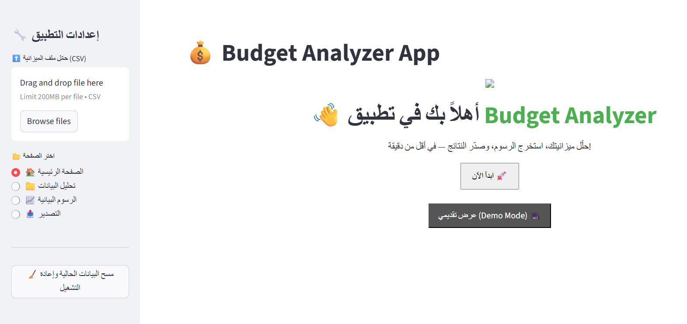

🇸🇦 Arabic version available [here](README.md)  
  
[](assets/BudgetAnalyzer_Documentation_AhmedElTayfy.pdf) 
[](https://data-analysis-devops-ajjiwigrbjayb86vtzed6e.streamlit.app)

📚 [View documentation on GitHub Wiki](../../wiki)

# 💰 Budget Analyzer | Streamlit-based Budget Analysis App 📊

An interactive Streamlit application that helps you analyze your budget quickly and professionally — ideal for personal finance, demos, or small business reporting.

---

## 🚀 Live Demo

[🔗 Launch the App](https://data-analysis-devops-ajjiwigrbjayb86vtzed6e.streamlit.app)

📎 For a presentation-friendly layout:  
[🎥 Demo Mode](https://data-analysis-devops-ajjiwigrbjayb86vtzed6e.streamlit.app/?mode=demo)

---

## 🧩 Key Features

- 📂 Instantly analyze uploaded CSV files  
- 🧪 Built-in sample data if no file is uploaded  
- 🖼️ Elegant welcome screen with app overview and logo  
- 🔁 Demo data button for quick testing  
- 🧹 Session reset without page reload  
- 📈 Interactive charts with Plotly and custom color schemes  
- 💾 Export results as CSV or Excel  
- 🧾 PDF report generation with Arabic support  
- 🎥 Presentation Mode that hides the sidebar  

---

## 🖼️ App Screenshot



---

## 🛠️ Run Locally

```bash
git clone https://github.com/AhmedEltayfy/data-analysis-devops.git
cd data-analysis-devops
pip install -r requirements.txt
streamlit run streamlit_app.py
